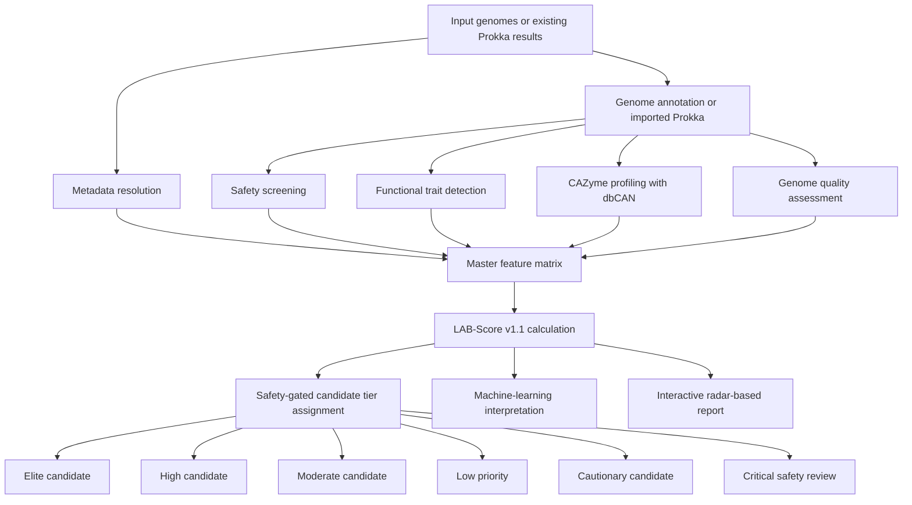
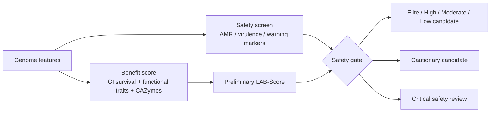

# LAB-Score

**LAB-Score** is a safety-gated genomic prioritization framework for lactic acid bacteria (LAB).  
It integrates genome annotation, antimicrobial resistance and safety-marker screening, functional trait detection, CAZyme profiling, LAB-Score calculation, machine-learning interpretation, and an interactive radar-based strain comparison report.

> **Pipeline version:** v3.5  
> **Scoring model:** LAB-Score v1.1  
> **Main use:** genome-based prioritization of LAB candidates for downstream experimental validation.

---

## Key features

- Accepts **genome assemblies** or **existing Prokka annotation folders**
- Supports nested Prokka folders, including species/accession-level directory structures
- Performs safety-gated candidate prioritization
- Screens functional trait panels relevant to probiotic, fermentation, and functional-food applications
- Integrates dbCAN-based CAZyme annotation
- Generates LAB-Score v1.1 candidate tiers
- Provides machine-learning feature interpretation
- Builds publication-ready figures and summary tables
- Includes an interactive HTML report with radar-based strain comparison
- Allows export of selected strain information as tables, figures, JSON files, and HTML reports

---

## Workflow



LAB-Score accepts genome assemblies or existing Prokka annotations and integrates metadata resolution, safety screening, functional trait detection, CAZyme profiling, genome quality assessment, LAB-Score calculation, machine-learning interpretation, and interactive radar-based reporting.

---

## Candidate-tier logic

LAB-Score uses a **safety-gated strategy**. Genomes with favorable functional profiles are prioritized only after safety screening. Genomes with cautionary or critical safety markers are separated into cautionary or critical-review categories rather than being ranked solely by functional potential.



---

## Repository structure

```text
LAB-Score/
├── README.md
├── QUICK_START.md
├── QUICK_START_RADAR.md
├── VERSION.txt
├── install.sh
├── run_all.sh
└── scripts/
    ├── 00_prepare_prokka_input.sh
    ├── 00_resolve_metadata.py
    ├── 00b_species_verify.py
    ├── 01_run_prokka.sh
    ├── 02_run_amrfinder.sh
    ├── 03_run_resfinder.sh
    ├── 04_run_dbcan.sh
    ├── 05_run_checkm.sh
    ├── 06_safety_screen.py
    ├── 07_panel_scan.py
    ├── 08_build_master_matrix.py
    ├── 09_calculate_lab_score.py
    ├── 10_ml_interpret.py
    ├── 11_make_figures.py
    └── 12_interactive_report.py
```

---

## Installation

LAB-Score v3.5 uses two conda environments:

```text
lab_score_clean  = main LAB-Score pipeline, Prokka, AMRFinderPlus, scoring, figures
dbcan_clean      = run_dbCAN/dbCAN only
```

Run:

```bash
bash install.sh \
  --env-name lab_score_clean \
  --dbcan-env-name dbcan_clean \
  --dbcan-db-dir /path/to/dbcan_database \
  --skip-optional
```

Example:

```bash
bash install.sh \
  --env-name lab_score_clean \
  --dbcan-env-name dbcan_clean \
  --dbcan-db-dir /media/mecob/komwit/db/dbcan \
  --skip-optional
```

Check installation:

```bash
bash run_all.sh \
  --check-only \
  --env lab_score_clean \
  --dbcan-env-name dbcan_clean \
  --dbcan-db-dir /media/mecob/komwit/db/dbcan
```

---

## Quick start

### Option 1: Run from genome assemblies

```bash
bash run_all.sh \
  -i genomes \
  -o results \
  -t 32 \
  --env lab_score_clean \
  --dbcan-env-name dbcan_clean \
  --dbcan-db-dir /media/mecob/komwit/db/dbcan
```

### Option 2: Run from existing Prokka results

```bash
bash run_all.sh \
  -p annotations_prokka_GCA \
  -o results_from_existing_prokka \
  -t 32 \
  --env lab_score_clean \
  --dbcan-env-name dbcan_clean \
  --dbcan-db-dir /media/mecob/komwit/db/dbcan \
  --skip-install \
  -n
```

The `-p` option accepts a Prokka result directory. Nested layouts are supported, for example:

```text
annotations_prokka_GCA/
├── Lactiplantibacillus_plantarum/
│   ├── GCA_000000001.1/
│   │   ├── GCA_000000001.1.gff
│   │   ├── GCA_000000001.1.faa
│   │   └── GCA_000000001.1.fna
```

---

## Main outputs

| Output | Description |
|---|---|
| `09_scores/LAB_score_v1.tsv` | Genome-level LAB-Score results and candidate tiers |
| `08_master_matrix/master_matrix.tsv` | Integrated feature matrix used for scoring |
| `09_scores/species_mean_scores.tsv` | Species-level LAB-Score summary when multiple species are available |
| `11_figures/` | Publication-ready summary figures |
| `12_report/LAB_score_report.html` | Interactive strain-level report with radar comparison |
| `08_master_matrix/dbcan_cazy_summary.tsv` | CAZyme family summary from dbCAN outputs |
| `10_ml/feature_importance.tsv` | Machine-learning feature interpretation |

---

## Interactive radar report

LAB-Score v3.5 includes an interactive report for strain-level interpretation.

Main functions:

- Search strains by genome ID, accession, species, strain name, tier, or safety status
- Filter by candidate tier and safety status
- Select multiple strains for radar-based comparison
- View detailed information for any selected strain
- Export selected strain tables
- Export single-strain information as TSV or JSON
- Export radar plots as PNG or SVG
- Export selected-strain or single-strain HTML reports

Generate only the interactive report:

```bash
python scripts/12_interactive_report.py \
  --scores results_from_existing_prokka/09_scores/LAB_score_v1.tsv \
  --matrix results_from_existing_prokka/08_master_matrix/master_matrix.tsv \
  --metadata results_from_existing_prokka/00_metadata/genome_metadata.tsv \
  --outdir results_from_existing_prokka/12_report
```

Open:

```text
results_from_existing_prokka/12_report/LAB_score_report.html
```

---

## Candidate tiers

LAB-Score v1.1 assigns genomes into refined safety-gated tiers:

| Tier | Interpretation |
|---|---|
| Elite candidate | Strong predicted profile with no major safety marker detected |
| High candidate | Favorable predicted profile suitable for further validation |
| Moderate candidate | Intermediate predicted profile |
| Low priority | Limited predicted benefit or incomplete feature support |
| Cautionary candidate | Functional potential present, but cautionary safety review required |
| Critical safety review | Critical safety markers detected; not recommended without detailed review |

---

## Important interpretation note

LAB-Score is a **genome-based prioritization framework**, not a replacement for phenotypic validation.

Candidate genomes assigned to elite or high tiers represent strains with favorable predicted profiles after safety gating. Their functional potential should be confirmed using targeted phenotypic assays, such as antimicrobial susceptibility testing, acid and bile tolerance, adhesion assays, bacteriocin activity, carbohydrate utilization, exopolysaccharide production, GABA production, or other application-specific experiments.

---

## Recommended data policy

Do not upload large genome datasets, Prokka outputs, dbCAN databases, AMRFinderPlus databases, or private metadata to this repository.

Recommended GitHub contents:

```text
Code
Small examples
Documentation
Workflow description
Version information
```

Recommended external deposition for large files:

```text
Zenodo
Figshare
NCBI SRA/Assembly
Supplementary tables
```

---

## Citation

If you use LAB-Score, please cite this repository and the associated manuscript when available.

```text
LAB-Score: a safety-gated genomic framework for prioritizing lactic acid bacteria candidates with interactive strain-level interpretation.
```

---

## License

This project is released under the MIT License.
