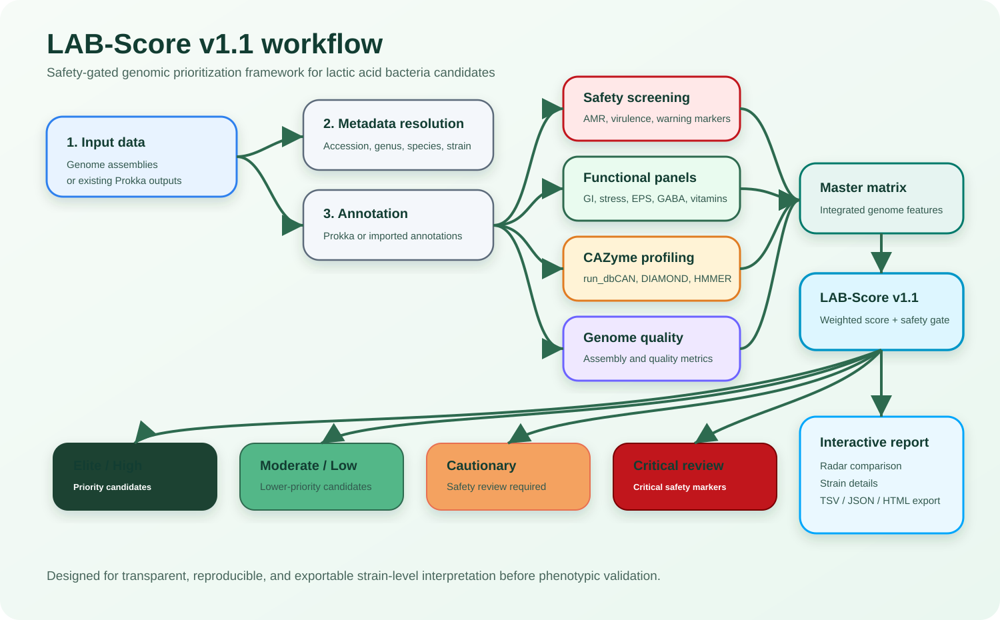
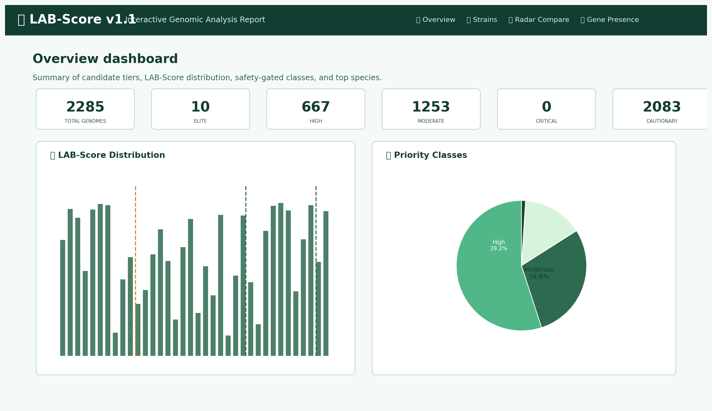
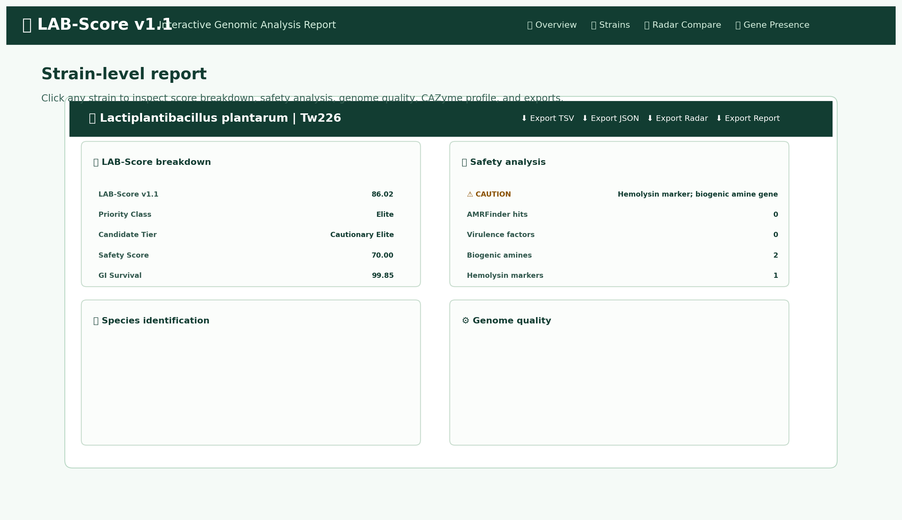
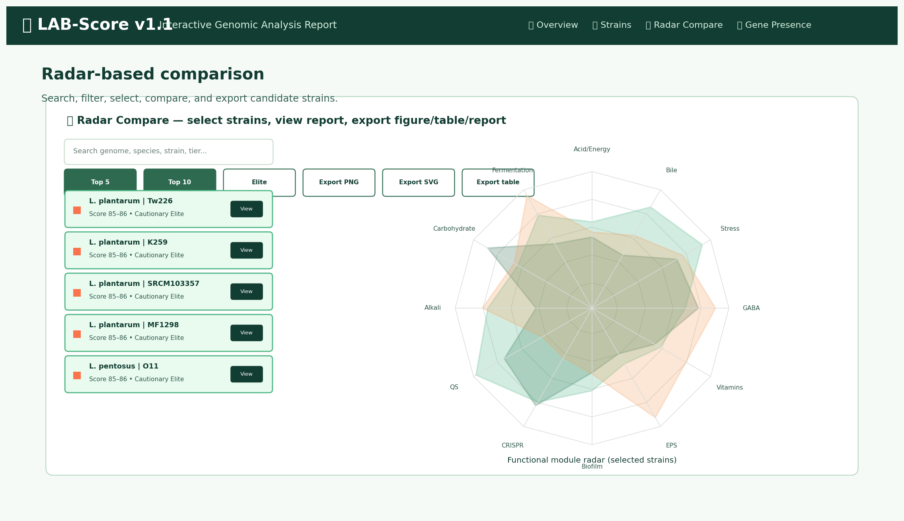
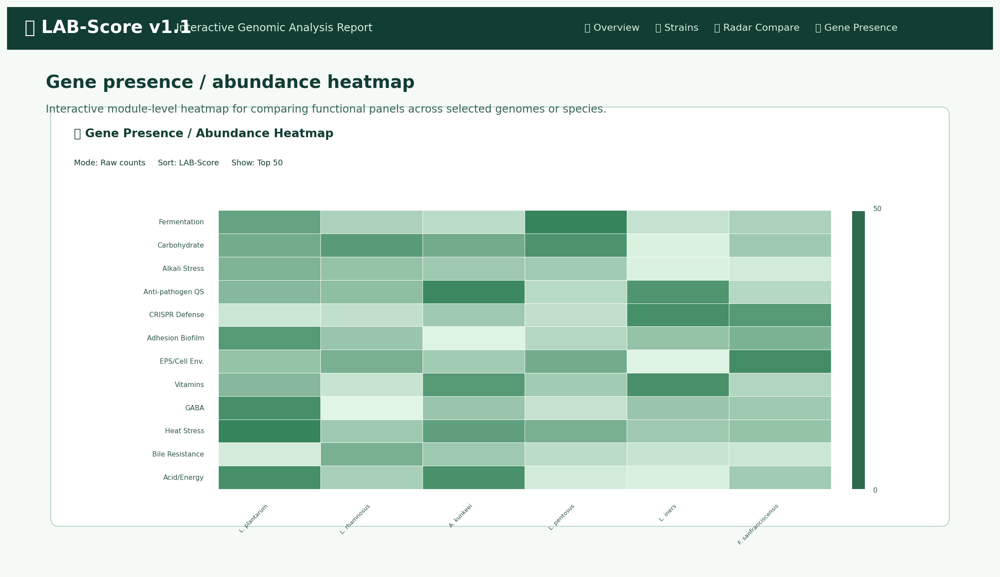

# LAB-Score

<p align="center">
  
</p>

<p align="center">
  <b>A safety-gated genomic prioritization framework for lactic acid bacteria candidates</b>
</p>

<p align="center">
  
  
  
  
</p>

---

## Overview

**LAB-Score** is a genome-based framework for prioritizing lactic acid bacteria (LAB) candidates for probiotic, fermentation, and functional-food applications.

The pipeline integrates:

- genome annotation or existing Prokka annotation import;
- metadata and species resolution;
- safety screening;
- antimicrobial resistance and virulence marker detection;
- functional trait panel scanning;
- dbCAN-based CAZyme profiling;
- genome quality integration;
- LAB-Score v1.1 calculation;
- machine-learning interpretation;
- interactive radar-based strain comparison and exportable reports.

> **Pipeline version:** v3.5  
> **Scoring model:** LAB-Score v1.1  
> **Recommended use:** candidate prioritization before experimental validation.

---

## Key features

- Accepts **raw genome assemblies** or **existing Prokka annotation folders**
- Supports nested Prokka layouts such as `species/accession/*.gff`
- Performs safety-gated LAB candidate classification
- Screens functional modules relevant to LAB applications
- Integrates dbCAN CAZyme annotation
- Produces genome-level and species-level score summaries
- Generates publication-ready figures and tables
- Includes an interactive HTML report
- Supports radar-based strain comparison
- Exports selected strain information as TSV, JSON, PNG, SVG, and HTML reports

---

## Interactive report preview

LAB-Score v3.5 generates an interactive HTML report for exploring large-scale LAB genome prioritization results.

### Overview dashboard

The overview dashboard summarizes the number of analyzed genomes, candidate-tier distribution, LAB-Score distribution, safety-gated classes, and top species.



### Strain-level report and export panel

Users can click any strain to view a detailed report containing LAB-Score breakdown, safety analysis, species identification, genome quality, CAZyme profile, and functional trait information. Each strain report can be exported as TSV, JSON, radar figure, or HTML report.



### Radar-based strain comparison

The Radar Compare tab allows users to search, filter, and select strains for side-by-side comparison across functional modules. Selected strains can be exported as figures, comparison tables, or strain-level reports.



### Gene presence / abundance heatmap

The Gene Presence tab provides an interactive heatmap for comparing functional panel abundance across selected genomes or species.



---

## Candidate-tier logic

LAB-Score uses a **safety-gated strategy**. Genomes with favorable functional profiles are prioritized only after safety screening. Genomes with cautionary or critical safety markers are separated into cautionary or critical-review categories rather than being ranked solely by functional potential.

| Tier | Interpretation |
|---|---|
| Elite candidate | Strong predicted profile with no major safety marker detected |
| High candidate | Favorable predicted profile suitable for further validation |
| Moderate candidate | Intermediate predicted profile |
| Low priority | Limited predicted benefit or incomplete feature support |
| Cautionary candidate | Functional potential present, but cautionary safety review required |
| Critical safety review | Critical safety markers detected; not recommended without detailed review |

---

## Repository structure

```text
LAB-Score/
├── README.md
├── QUICK_START.md
├── QUICK_START_RADAR.md
├── VERSION.txt
├── LICENSE
├── .gitignore
├── install.sh
├── run_all.sh
├── docs/
│   └── images/
│       ├── lab_score_workflow.svg
│       ├── overview_dashboard.png
│       ├── strain_detail_modal.png
│       ├── radar_compare.png
│       └── gene_presence_heatmap.png
└── scripts/
    ├── 00_prepare_prokka_input.sh
    ├── 00_resolve_metadata.py
    ├── 00b_species_verify.py
    ├── 01_run_prokka.sh
    ├── 02_run_amrfinder.sh
    ├── 03_run_resfinder.sh
    ├── 04_run_dbcan.sh
    ├── 05_run_checkm.sh
    ├── 06_safety_screen.py
    ├── 07_panel_scan.py
    ├── 08_build_master_matrix.py
    ├── 09_calculate_lab_score.py
    ├── 10_ml_interpret.py
    ├── 11_make_figures.py
    └── 12_interactive_report.py
```

---

## What does `install.sh` do?

The `install.sh` script prepares the software environment required to run LAB-Score. It was designed to avoid common dependency conflicts in bioinformatics workflows by separating the main LAB-Score environment from the dbCAN environment.

### Environment design

LAB-Score uses two conda environments:

| Environment | Purpose |
|---|---|
| `lab_score_clean` | Main LAB-Score workflow, Prokka, AMRFinderPlus, scoring, figures, and interactive report |
| `dbcan_clean` | Dedicated environment for run_dbCAN, DIAMOND, HMMER, Prodigal, and CAZyme annotation |

This separation is important because run_dbCAN can create Python dependency conflicts when installed together with other bioinformatics tools.

### Main functions of `install.sh`

`install.sh` performs the following steps:

1. Checks whether conda is available.
2. Creates the main LAB-Score conda environment.
3. Creates a separate dbCAN conda environment.
4. Installs core Python packages such as `pandas`, `numpy`, `scikit-learn`, and `matplotlib`.
5. Installs Prokka and required Perl dependencies.
6. Installs AMRFinderPlus and updates the AMRFinderPlus database.
7. Installs FastANI for optional species verification.
8. Installs run_dbCAN, DIAMOND, HMMER, Prodigal, and supporting dbCAN dependencies.
9. Downloads or checks the dbCAN database.
10. Performs a final prerequisite check.

### Recommended installation command

```bash
bash install.sh \
  --env-name lab_score_clean \
  --dbcan-env-name dbcan_clean \
  --dbcan-db-dir /media/mecob/komwit/db/dbcan \
  --skip-optional
```

### Check installation only

```bash
bash run_all.sh \
  --check-only \
  --env lab_score_clean \
  --dbcan-env-name dbcan_clean \
  --dbcan-db-dir /media/mecob/komwit/db/dbcan
```

### Useful installation options

| Option | Meaning |
|---|---|
| `--env-name` | Name of the main LAB-Score conda environment |
| `--dbcan-env-name` | Name of the separate dbCAN conda environment |
| `--dbcan-db-dir` | Directory for the dbCAN database |
| `--skip-optional` | Skip optional tools such as CheckM, ResFinder, or SHAP |
| `--skip-dbcan-db` | Do not download the dbCAN database |
| `--recreate-env` | Delete and recreate the main LAB-Score environment |
| `--recreate-dbcan-env` | Delete and recreate the dbCAN environment |
| `--check` | Check prerequisites only without installing |

### When should I use `--recreate-dbcan-env`?

Use this option if run_dbCAN is broken or if the system accidentally uses an old run_dbCAN from another conda environment.

```bash
bash install.sh \
  --env-name lab_score_clean \
  --dbcan-env-name dbcan_clean \
  --dbcan-db-dir /media/mecob/komwit/db/dbcan \
  --recreate-dbcan-env \
  --skip-optional
```

---

## Quick start

### Option 1: Run from genome assemblies

```bash
bash run_all.sh \
  -i genomes \
  -o results \
  -t 32 \
  --env lab_score_clean \
  --dbcan-env-name dbcan_clean \
  --dbcan-db-dir /media/mecob/komwit/db/dbcan
```

### Option 2: Run from existing Prokka results

```bash
bash run_all.sh \
  -p annotations_prokka_GCA \
  -o results_from_existing_prokka \
  -t 32 \
  --env lab_score_clean \
  --dbcan-env-name dbcan_clean \
  --dbcan-db-dir /media/mecob/komwit/db/dbcan \
  --skip-install \
  -n
```

The `-p` option accepts a Prokka result directory. Nested layouts are supported, for example:

```text
annotations_prokka_GCA/
├── Lactiplantibacillus_plantarum/
│   ├── GCA_000000001.1/
│   │   ├── GCA_000000001.1.gff
│   │   ├── GCA_000000001.1.faa
│   │   └── GCA_000000001.1.fna
```

---

## Main outputs

| Output | Description |
|---|---|
| `09_scores/LAB_score_v1.tsv` | Genome-level LAB-Score results and candidate tiers |
| `08_master_matrix/master_matrix.tsv` | Integrated feature matrix used for scoring |
| `09_scores/species_mean_scores.tsv` | Species-level LAB-Score summary when multiple species are available |
| `11_figures/` | Publication-ready summary figures |
| `12_report/LAB_score_report.html` | Interactive strain-level report with radar comparison |
| `08_master_matrix/dbcan_cazy_summary.tsv` | CAZyme family summary from dbCAN outputs |
| `10_ml/feature_importance.tsv` | Machine-learning feature interpretation |

---

## Interactive radar report

Generate only the interactive report:

```bash
python scripts/12_interactive_report.py \
  --scores results_from_existing_prokka/09_scores/LAB_score_v1.tsv \
  --matrix results_from_existing_prokka/08_master_matrix/master_matrix.tsv \
  --metadata results_from_existing_prokka/00_metadata/genome_metadata.tsv \
  --outdir results_from_existing_prokka/12_report
```

Open:

```text
results_from_existing_prokka/12_report/LAB_score_report.html
```

---

## Important interpretation note

LAB-Score is a **genome-based prioritization framework**, not a replacement for phenotypic validation.

Candidate genomes assigned to elite or high tiers represent strains with favorable predicted profiles after safety gating. Their functional potential should be confirmed using targeted phenotypic assays, such as antimicrobial susceptibility testing, acid and bile tolerance, adhesion assays, bacteriocin activity, carbohydrate utilization, exopolysaccharide production, GABA production, or other application-specific experiments.

---

## Recommended data policy

Do **not** upload large genome datasets, Prokka outputs, dbCAN databases, AMRFinderPlus databases, or private metadata to this repository.

Recommended GitHub contents:

```text
Code
Small examples
Documentation
Workflow description
Version information
```

Recommended external deposition for large files:

```text
Zenodo
Figshare
NCBI SRA/Assembly
Supplementary tables
```

---

## Citation

If you use LAB-Score, please cite this repository and the associated manuscript when available.

```text
LAB-Score: a safety-gated genomic framework for prioritizing lactic acid bacteria candidates with interactive strain-level interpretation.
```

---

## License

This project is released under the MIT License.
